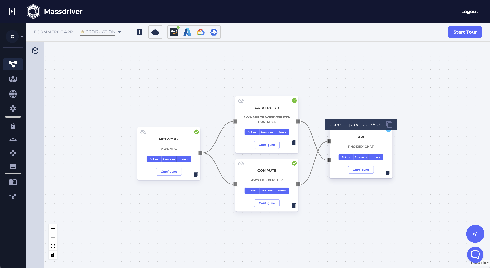

# Deploy applications on Massdriver.

This application must be published as a [bundle](https://docs.massdriver.cloud/applications) to Massdriver first and be configured for a given environment (target).

## Examples

<!--

-->

```shell
mass app deploy ecomm-prod-api
mass app deploy ecomm-prod-api-x12g
```

For more info see [deploying](https://docs.massdriver.cloud/applications/deploying-application).
